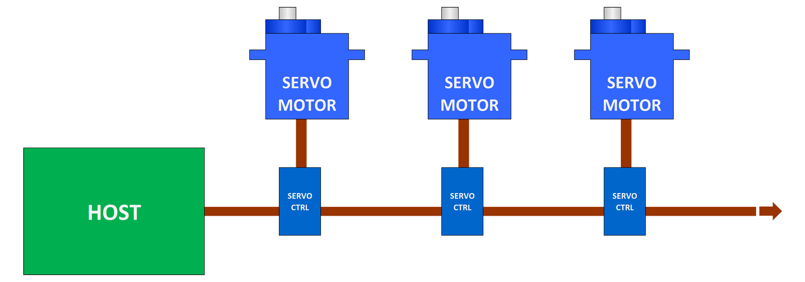

# A PIC based distributed servo controller

## Overview
This project build a PIC based controller for a servo motor. The controllers can be daisy chained so that the host just needs a single serial port to drive multiple servo motors. A series of blogs on the <a href="http://siliconjunction.blogspot.com.au">Silicon Junction blog</a> starting with <a href="http://siliconjunction.blogspot.com/2020/03/daisy-chain-servo-controller.html">this one</a> provides more information.

 

 
